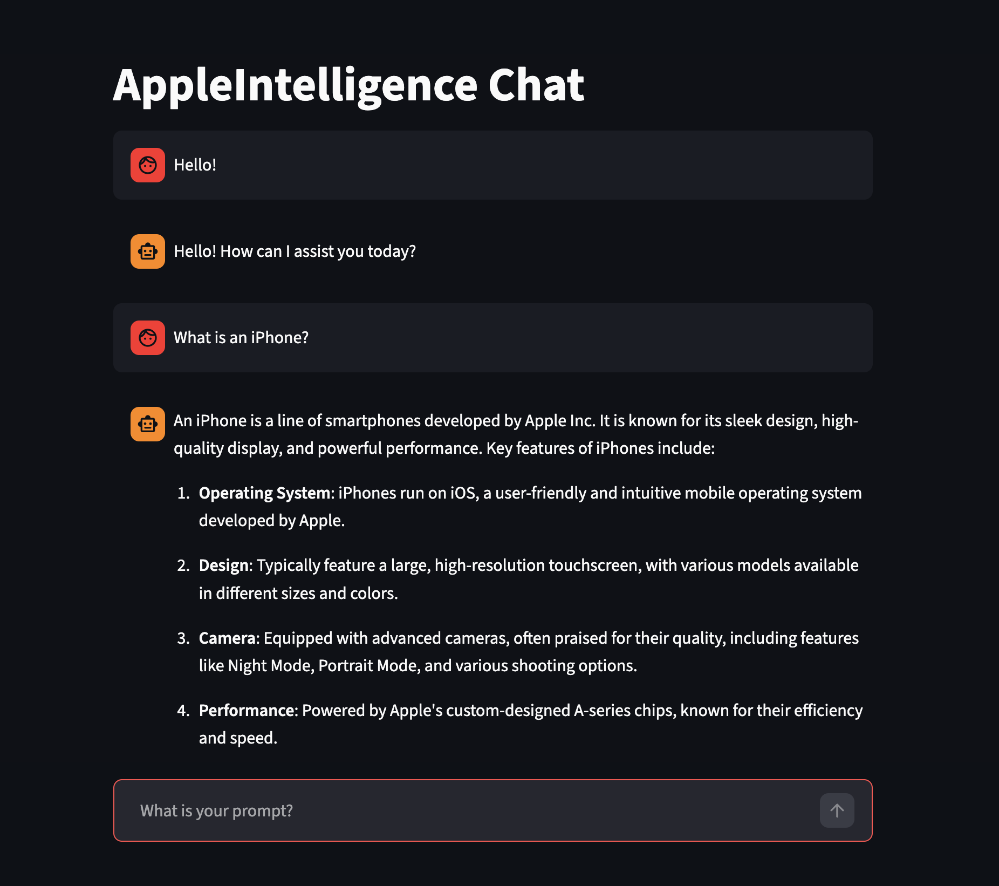

##  Apple Intelligence LangChain Wrapper

This project bridges the gap between Apple's native on-device LLMs (available on M-series Macs) and the Python AI ecosystem. It wraps a local Swift-based API server into a custom LangChain class, allowing you to build standard AI applications (RAG, Agents, Chatbots) using Apple's private, local models.

> [!NOTE]
> Unfortunately, the on-device foundational models have a maximum context window of 4,096 tokens per language model session. So complex workflows are not reccomended.

### Features

- ##### Native Performance:

  Utilizes the Apple Intelligence API directly on-device (no cloud keys required).

- ##### LangChain Integration:

  Exposes a custom `LocalLLM` class compatible with LangChain's ChatModel interface.

- ##### Chat Interface:
  Try interacting with your on-device foundational model with
  ```bash
  streamlit run chat.py
  ```

Requirements:

- Apple Intelligence-enabled device
- Swift 6.0+

```bash
git submodule update --init --recursive
```

### Code Example

If you want to use the model in your own script without Streamlit:

```py
from model.client import LocalLLM

# Initialize the model

llm = LocalLLM()

# Run a query

response = llm.invoke("Explain quantum computing in one sentence.")
print(response.content)
```


